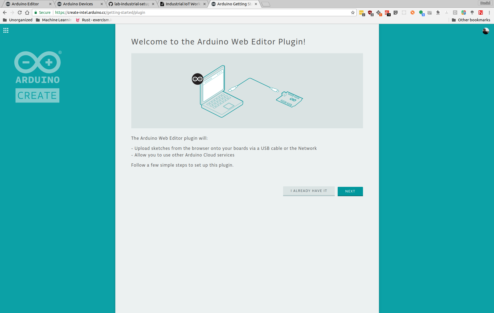

[Workshop Agenda](README.md) > [UP2 Getting Started Guide](up2-getting-started.md) > [Install the Arduino Create Agent](up2-setup)

# Installing the Arduino Create Agent

The Arduino Create Agent is a small service that connects your development computer to your prototyping board. Even though the development environment is a web application in the cloud, you still must have the prototyping board and your development computer on the same network.

## Installation Steps
To install the Arduino Create Agent, you must first go to [http://create.arduino.cc/](http://create.arduino.cc/) and click on the **My Devices** link.

 Click on **Add a new Device**.

 Select the **Next** button.

 Select the **Set up the Arduino Plugin to start coding online** link.

 Note:  If you don’t already have an Arduino Create account, follow the onscreen instructions to sign up. You'll need to activate your account and log into the site using your new account.

 The Arduino Create website will detect your OS and begin downloading the Os specific Arduino Create Agent.

Install the Agent and you will see if appear in the system tray of UI menu of your operating system.

## Connecting over IP Networking
After you install the Arduino Create Agent, it will use the USB cable that you connected from the Up2 Board to your development computer to login to your Up2 Board, get the IP address and complete the registration process with the Arduino Create environment.

If you find yourself on this "Connecting your board to Arduino Create" screen for than 3 minutes, check your connections (Ethernet, micro USB, power) and try again.  If that doesn’t work, try these troubleshooting tips:

* Completely restart your UP² board by removing the power supply and the micro USB cable. Then power it back on. Wait a couple of minutes for it to boot, then try to connect to Arduino Create again.
* If your host computer has Windows*, minimize all windows to make sure you haven’t missed a pop-up message asking you to install a driver.
* Force a "hard refresh" on the Arduino web page. For example, if you’re on Chrome*:
* For Windows, press Ctrl+Shift+R.
* For macOS*, hold Shift and click the Reload button.

## Name Your Computer
Lastly, you will be asked to name Your Up2 board.

## Now You Can Begin Coding
