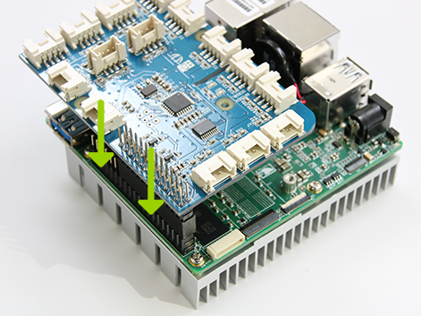
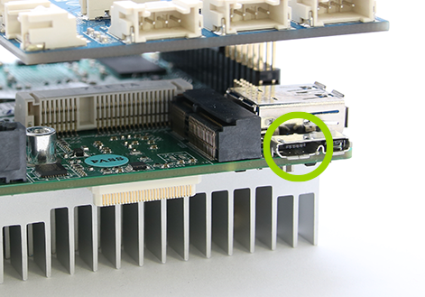
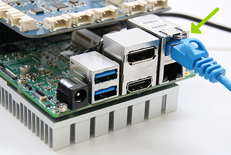
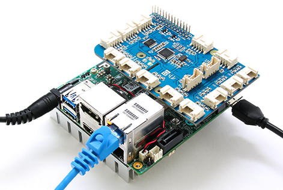

[Workshop Agenda](README.md) > [UP2 Getting Started Guide](up2-getting-started.md) > [Setup Hardware](up2-getting-started.md)

## Setup the Up2 Hardware
On the UP²* board locate connector 1 on the board. it is next to the screw that is circled in the photo.

Line up pin 1 on the Grove Pi+ board with connector 1 on the UP² board, and carefully press down so that the pins on the Grove Pi+ board slide neatly into the connectors

Plug the micro USB cable into the left side of the USB port on the UP² board.

Connect the micro USB cable to your host computer.
**Note: Even though you might see lights turn on after you plug in the micro USB cable, this connection isn't enough to power your board reliably. The micro USB connection is used to set up the Arduino Create development environment. You'll connect the board to a power supply shortly.**

Plug the Ethernet cable into the UP² board.

Plug the other end of the Ethernet cable into your router, connecting it to the same network as your host computer.
Note: Your host computer does not need to be on the same network as your UP² board.

**Note: If you need to turn off your board, you can do so by pressing the small white button next to the blue LED, or you can simply unplug the power cable.**

### Powering on your board
Power on your UP2 board. You should see a blue LED light up near the power connector.

We’ll come back to using the hardware after setting up the Arduino Create development environment.

## Next Step
[Setup Arduino Create Agent](setup-arduino-create-agent.md)
